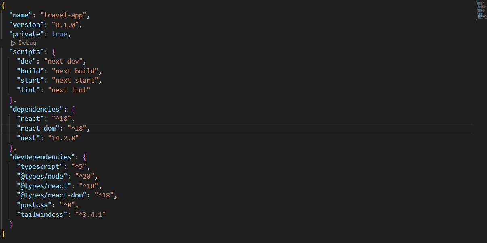

# Traveling Application - Front-End

Welcome to the **Traveling Application**! This project is a front-end implementation of a traveling platform, serving as a foundation for building larger, more complex applications. 

## Table of Contents

- [Traveling Application - Front-End](#traveling-application---front-end)
  - [Table of Contents](#table-of-contents)
  - [Technologies](#technologies)
  - [Interfaces](#interfaces)
    - [Home Interface](#home-interface)
    - [Full Screen Shot of the Project](#full-screen-shot-of-the-project)
  - [Installation](#installation)

## Technologies

The application is built using the following technologies:

- **React**: A flexible JavaScript library for building user interfaces, used to create reusable components.
- **TypeScript**: A superset of JavaScript that adds static typing, improving code quality and maintainability.
- **Tailwind CSS**: A utility-first CSS framework for styling, enabling rapid design without leaving the HTML.

The full list of dependencies can be found in the `package.json` file.



## Interfaces

### Home Interface

The Home interface provides an overview of the application and allows users to navigate easily through different sections.


### Full Screen Shot of the Project

Here’s a complete view of the application interface, showcasing its overall design and layout.


## Installation

1. Clone the repository:
   ```bash
   git clone https://github.com/Wahya1/travelling-app.git
   cd traveling-app
